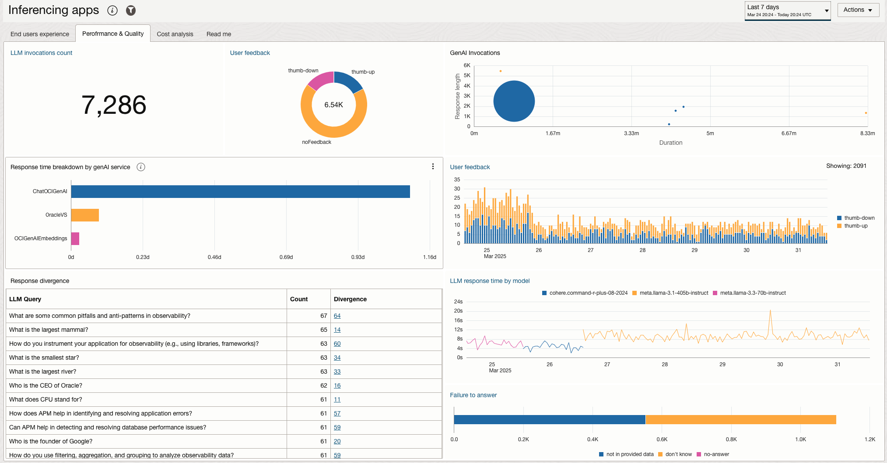

## OCI Application Performance Monitoring 
# Inferencing App Monitoring

Monitoring an inferencing application is crucial for ensuring its performance, reliability, and scalability. By tracking response times, detecting errors, and maintaining model accuracy, monitoring safeguards against issues like data drift or inefficiencies. It helps ensure compliance with regulations, strengthens security, and optimizes resource usage to enhance cost efficiency.

[OCI Application Performance Monitoring](https://www.oracle.com/manageability/application-performance-monitoring/) enables application observability through a distributed tracing service. This is the perfect technology to use for monitoring of an inferencing apps.

This repository contains files and information enabling such monitoring with the 
[OCI APM Service](https://www.oracle.com/manageability/)

## Table of Contents
1. Getting started
2. Dashboard to be imported as APM custom dashbord   
3. Python file to be included with apps that are built using LangChain 
4. Span diemnsions used in the dashbaord
5. Few additional TQLs (trace query languge) examples 
6. TODO: add an instrumented demo app (index.html + langchain python backend)

## Getting started
1. [Create an APM domain](https://docs.oracle.com/en-us/iaas/application-performance-monitoring/doc/create-apm-domain.html). You will need the upload URL and private and public data keys when instrumenting your application.
2. Instrumentation (see here for details: [Configure APM data sources](https://docs.oracle.com/en-us/iaas/application-performance-monitoring/doc/configure-application-performance-monitoring-data-sources.html))
    - UI: Add and configure the browser agent to the index.html
    - If the backend is a java app, use the [APM Java agent](https://cloud.oracle.com/apm/apm-admin/admin/downloadAgents) to instrument it
    - For python apps use [OTEL agent](https://opentelemetry.io/docs/languages/python/).
    - Other languages - use relavnt OTEL compliant agent/tracer (APM support the native OTEL protocol)

## Import the dashbaord
- downlaod [Inferencing apps](inferencing-apps.json) and import it to the [Dashboard service](https://cloud.oracle.com/management-dashboard/dashboards). The json file includes several widgets used in this dashboard, all will be imported with the same one operation. 

## Instrumentation helper class for LangChain (python) based apps
The file [apm_otel_langchain_oci.py](apm_otel_langchain_oci.py) comntains a simple instrumentation helper method that can be used to instrument the LangChain calls to genAIi services. The file include instrumentation of the invoke, embed_documents, and similarity_search methods, when used with the OCI langcahin community extension. Add to these any other langChain calls made by your application.
Instrument the application with OTEL (e.g. use opentelemetry-instrument) and then add this code (before any calls to the instrumented classes) to enable the instrumentation:

    from opentelemetry import trace
    import otel_langchain_oci
    tracer = trace.get_tracer(__name__)
    otel_langchain_oci.init(tracer)

You can use the *tracer* to add spans anywhere within your code to provide more relevant information. e.g:

    @app.post("/invoke", tags=["V1"])
    #@tracer.start_as_current_span("post-invoke")
    def invoke(request: InvokeInput, conv_id: str, myauth: str):
        """
        This function handle the HTTP request
        """
    let current_span = trace.get_current_span()
    current_span.set_attribute("genAiConvId", conv_id)
    current_span.set_attribute("genAiQuery", request.query)
    ...

## Span attributes used in the dashboard
The dashboard uses the attribute as described below. Some may not be relevant in your case, others may be difficult to capture. You can adjust the queries used in each of the widget to meet your needs and available data. 
### 1. Attributes captured in the UI
- genAiQuery
- genAiResponse
- genAiFeedback
- sessionId
- userName

### 2. Attributes captured in backend app (likly from the one server method)
- genAiConvId  (conversation id, equals to session id on the UI)
- genAiQuery
- genAiResponse

### 3. Attributes captured from call to the GenAi services (see [apm_otel_langchain_oci.py](apm_otel_langchain_oci.py))
- genAiSerivce (e.g. ChatGenAI, GenAIEmbeding, etc.)
- genAiQuery
- genAiResponse
- genAiResposneLength
- genAiQueryLength
- genAiPromptLength
- genAiModel

### 4. Token and Cost attributes 
These can be captured from the service APIs (token count) or can be calculated using the APM Span enrichment capability
- genAiCost
- genAiTokens

Example of span enrichment rule that calculates cost of an LLM invocations and store it as a span metric:

### 5. TQL exmaples
(you can save these and others into a query bar in Trace Explorer)
1. LLM Performace:

    `show spans *, percentile(SpanDuration, 90) as P90 where genAiModel is not omitted group by genAIservice, genAiModel, operationName timeseries for count(*)`

2. Slowest answered queries:

    `show spans genAiQuery, SpanDuration, genAiResponse where kind='SERVER' and genAiQuery is not omitted order by SpanDuration desc`

3. Time by genAi service type:

    `show spans genAiService, sum(spanDuration) as totalDuration, count(*) as Count where genAiService is not omitted group by genAiService order by sum(spanDuration)`

4. Cost of thumbed down responses:

    `show spans count(*), sum(genAiCost) as "Cost of thumb-down answers" where traceid in (show spans max(case when genAiFeedback is omitted then traceid end) as traceid   where sessionid is not omitted and (genAiFeedback = 'thumb-down' or genAiFeedback is omitted) group by sessionId, genAiQuery having count(*) = 2 first 10000 rows)`

5. Aborted queries (user refreshed the page, closed the browser, etc. before the response was available):
   
   `show spans count(*) as "Aborted queries", avg(spanDuration) as "Avg duration", max(spanDuration) as "Max duration", percentile(SpanDuration, 90) as P90 where kind='SERVER' and genAiQuery is not omitted and traceid in (show traces traceid where TraceStatus ='Incomplete' first 10000 rows) timeseries for count(*), max(spanDuration)`

